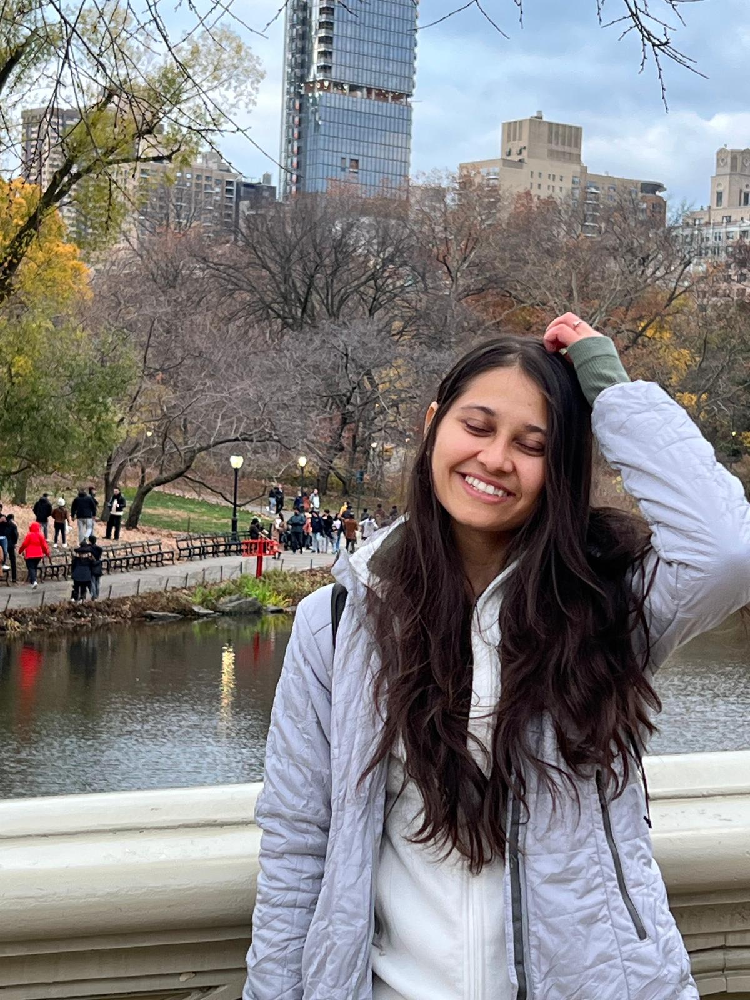

{: style="float: right; margin: 0px 20px; width: 250px; border-radius: 50%" name="fox"}

I am Amandeep Kaur (Reehal), a PhD student at [ASU](https://www.asu.edu/), advised by [Dr. Hannah Kerner](https://hannah-rae.github.io/). Currently, i'm interested in studying the impacts of data distribution of large volumes of pretraining data used in Foundational models, specifically GeoFoundational models.

Previously, as part of Google Deepmind, I was working on AMED(Agricultural Monitoring and Event Detection), creating ML/DL models to generate pan-India crop covers 
for top-10 Indian crops using Sentinel1-2, under the guidance of [Alok Talekar](https://research.google/people/106902/?&type=google) and 
[Dr. Gaurav Aggarwal](https://scholar.google.com/citations?user=9XiIwDQAAAAJ&hl=en). 

Before Google, I was at IIIT-D,
pursuing my Bachelor's in CSE where I first got into research. I had the pleasure of working with [Dr Rahul Purandare](https://scholar.google.com/citations?user=_OLz-J0AAAAJ&hl=en) 
in the summer of my 2nd year. Then under the guidance of [Dr. Jainendra Shukla](https://scholar.google.es/citations?user=QCZleNQAAAAJ&hl=en), I did an independent project where 
I created a system to collect audio speech samples from Indian students for our project on improving English pronunciation of Indian students. As part of my Bachelor's Thesis, 
I worked on improving a head gesture guided typing system for people with limited body motion, under the supervision 
of [Dr. Rajiv Ratn Shah](https://scholar.google.com.sg/citations?user=WAChZv4AAAAJ&hl=en).

## News 

__2023__
* First(?): Started doctorate at Arizona State University

__2023__
* First: [Paper](https://agu.confex.com/agu/fm23/meetingapp.cgi/Paper/1286158) accepted to AGU'23. 
* First: [Oral] at AGU'23. Spoke about detecting field level crop seasons. 

__2022__
* First: Job at Google Deepmind(previously, Google Research India). Worked with Anthrokrishi to study Indian farm fields using satellites. My google maps is always set to satellite view XD
* First: Gave a [talk](https://www.youtube.com/watch?v=lCFbbOgsm9I&t=1613s) presenting Anthrokrishi's work at Google for India(G4I'22).

__2021__
* First: Interned at Royal Bank of Scotland(Natwest Group) as a software development intern. Did a lot of Java. 
* AI for Social Good: Began my two-semester Bachelor's thesis, worked on assistive typing technology which used head gestures. Met transformers for the first time.

__2020__
* AI for Social Good: Woked with the [Human Machine Interaction Lab, IIITD](https://hmi.iiitd.edu.in/) to build a system to help improve Indian students english pronunciations. Ask me about phonemes, utterances and speech in kids. 

__2019__
* First: Research experience as part of a software development intern in the [Program analysis Group, IIITD](https://pag.iiitd.edu.in/). :D
